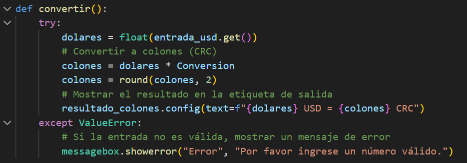
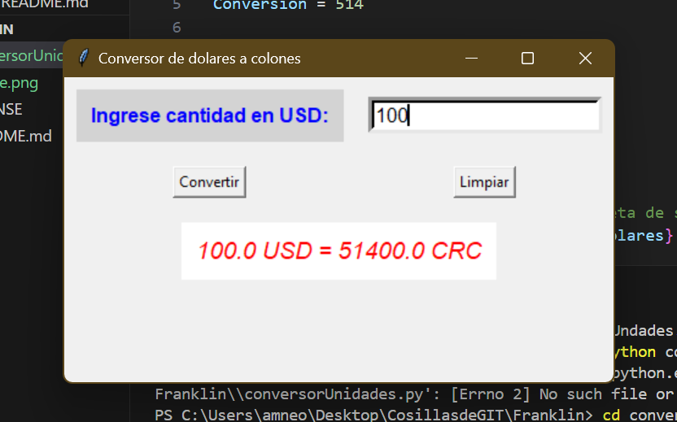
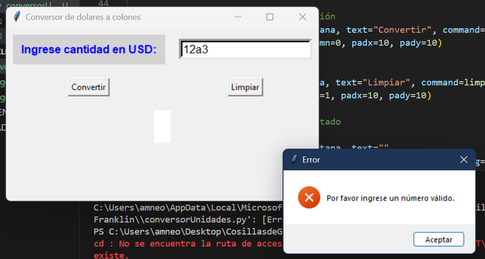
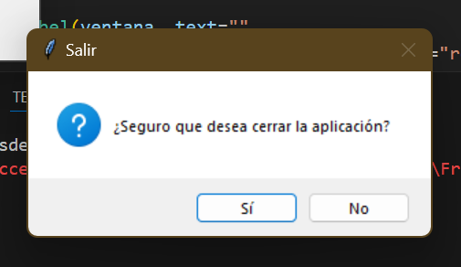

**Propietario:** André Crotta Núñez

## Instrucciones de uso:

1. Clona el repositorio:

   git clone https://github.com/acttnz/Franklin.git

2. Navega al directorio del proyecto: 

    cd conversorUnidades

3. Ejecuta el código: 
    python conversorUnidades.py

*Explicación del código:*

1. Conversión regular con resultado esperado:

_Esta parte del código será la barrera de una entrada valida, en caso de serla, nos sale el resultado exitosamente:_

2. Valor inválido ingresado para la conversión con el mensaje de error.

_En caso de ser una entrada invalida, nos sale este mensaje:_

3. Ventana emergente al cerrar la ventana.

_Al cerrar el programa, nos aparece la siguiente ventana emergente:_

_*El resto del código tambié viene comentado, para una mejor explicación.*_

